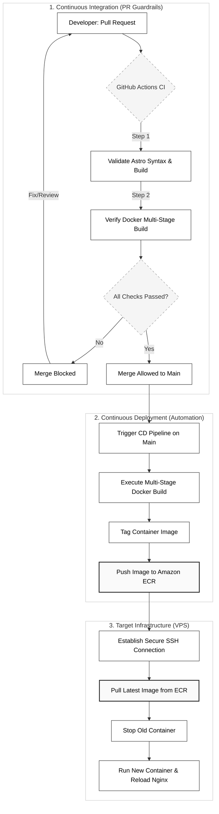

Deploying a web application it doesn't seems to difficult, until you steer in that direction ...

I really don't like to be told what can I expect from the future. And today I remember every time I'd hit my brain.

## 1. Declarative infrastructure

Now that I look back, there is a loot of things(like gettin stuck) that I could avoid if someone just stick to read the f\* documentation.

It is insane how can we declare an entire setup with just a couple lines of code.

```hcl
# infra/main.tf
resource "aws_instance" "web_server" {
  ami           = "ami-0c7217cdde317cfec" # Ubuntu LTS
  instance_type = "t2.micro"

  tags = {
    Name = "smol-ivan-vps"
  }
}

resource "aws_ecr_repository" "app_repo" {
  name                 = "smol-ivan-web"
  image_tag_mutability = "MUTABLE"
}
```

## 2. Complete development flow


