Deploying a web application it doesn't seems to difficult, until you steer in that direction ...


Jk that is me begin dramatic, but I am not lying, gettin use to the cloud could be chaotic at the start

<!-- I really don't like to be told what can I expect from the future. And today I remember every time I'd hit my brain. -->

## 1. Declarative infrastructure

Now that I look back, there is a lot of things that I could avoid if someone just stick to read the f\* documentation.

It is insane how can we declare an entire setup with just a couple lines of code.

```hcl
# infra/main.tf
resource "aws_instance" "web_server" {
  ami           = "ami-0c7217cdde317cfec" # Ubuntu LTS
  instance_type = "t2.micro"

  tags = {
    Name = "smol-ivan-vps"
  }
}

resource "aws_ecr_repository" "app_repo" {
  name                 = "smol-ivan-web"
  image_tag_mutability = "MUTABLE"
}
```

## 2. Multi-Stage Containerization

To maintain zero-dependency environment on the host vps, the Astro application is packaged inside an isolated Docker container. A multi-stage structure splits the node building dependencies from the final lightweight execution target running Nginx.

```Dockerfile
# Stage 1: Build the application
FROM node:lts-alpine AS build
WORKDIR /app
COPY package*.json ./
RUN npm ci
COPY . .
RUN npm run build

# Stage 2: Serve via Nginx
FROM nginx:alpine
COPY --from=build /app/dist /usr/share/nginx/html
COPY nginx/nginx.conf /etc/nginx/conf.d/default.conf
EXPOSE 80
```

## 3. Complete development flow

Once the pull request is approved and merged, a second pipeline executes the automated deployment. It builds the stable image, pushes it to Amazon ECR, connects to the VPS over an isolated SSH connection, pulls the newest container layer, and reloads Nginx dynamically.

Pretty insane 

- Automated state synchronization on merge.
- Secure certificate routing managed on the VPS via Let's Encrypt.
- Zero software requirements on the server except Docker and an SSH daemon.

```mermaid
flowchart LR

%%========================
%% Styles
%%========================
classDef default fill:#ffffff,stroke:#333,stroke-width:1px,color:#000;
classDef decision fill:#f8f8f8,stroke:#666,stroke-width:1px,stroke-dasharray:5 5;
classDef aws fill:#FFF8E8,stroke:#FF9900,stroke-width:1px;
classDef infra fill:#F3F3F3,stroke:#666,stroke-width:1px;

%%========================
%% CI
%%========================
subgraph CI["1. Continuous Integration (Pull Request Validation)"]
direction TB

A[Developer opens Pull Request]

B[GitHub Actions CI]

C[Validate Astro Project]

D[Build Multi-Stage Docker Image]

E{All checks passed?}

F[❌ Merge Blocked]

G[✅ Merge into main]

A --> B
B --> C
C --> D
D --> E
E -->|No| F
F -. Fix issues .-> A
E -->|Yes| G

end

%%========================
%% CD
%%========================
subgraph CD["2. Continuous Deployment"]
direction TB

H[Trigger GitHub Actions CD]

I[Build Production Docker Image]

J[Tag Image]

K[Push Image to Amazon ECR]

G --> H
H --> I
I --> J
J --> K

end

%%========================
%% VPS
%%========================
subgraph DEPLOY["3. VPS Deployment"]
direction TB

L[Connect via SSH]

M[Pull Latest Image]

N[Stop Previous Container]

O[Start New Container]

P[Reload Nginx]

K --> L
L --> M
M --> N
N --> O
O --> P

end

%%========================
%% Styles
%%========================
class E decision;
class K,M aws;
class L,N,O,P infra;
```


