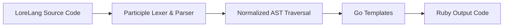

During my compilers course at university, our professor gave us a clear directive: don't build another Python clone or C wrapper. Instead, pick a specific domain where a custom tool could actually improve developer experience or workflow clarity.

I've played many video games over the years. While I always loved rich story-driven games and cinematics, NPC interactions frequently felt static or overly linear. Managing global game events, story phases, and dynamic dialogue states in standard code often gets messy very quickly.

That was the initial spark for **LoreLang**—a lightweight Domain-Specific Language (DSL) designed to express NPC behavior states and narrative triggers more naturally.

## 1. Evolution of the Toolchain

In the early weeks of the class, we stuck to traditional tools like Yacc and Lex to grasp parsing theory. However, when it came to building the final implementation, I shifted to **Go** using the [`participle`](https://github.com/alecthomas/participle) parsing library alongside Go's native templating engine.

Go made the parser code significantly easier to maintain and reason about compared to traditional C-based lexer tools.

```go
// How go looks inside LoreLang, language definition
type Program struct {
	Character *Character `@@ EOF`
}

type Character struct {
	Name             string          `"Personaje" @String "{"`
	Attributes       []Attribute     `"Atributos" "{" @@* "}"`
	KnowledgeEntries []Entry         `"Conocimientos" "{" @@* "}"`
	Restrictions     []Entry         `"Restricciones" "{" @@* "}"`
	GlobalBehavior   *GlobalBehavior `"ComportamientoGlobal" "{" @@ "}"`
	InitialState     string          `"EstadoInicial" ":" @Ident ";"`
	States           []State         `@@+ "}"`
}

type Attribute struct {
	Key   string `@Ident ":"`
	Value string `@String ";"`
}
```

## 2. Target Architecture: Ruby State Machines

Due to time constraints and the scope of the course, target integration with engines like Unity was out of reach.

The compromise was transpiling LoreLang definitions into Ruby state machines. Ruby wasn't chosen for complex technical reasons; it was simply a fun way to step outside the usual Java and Python ecosystem we often default to in coursework.

## 3. The Real Technical Challenge: AST Normalization

Writing the grammar rules wasn't the hard part. The real challenge was traversing the Abstract Syntax Tree (AST) and normalizing the data structures so they could be cleanly handed off to the code generator.



Normalizing the tree required separating the core AST evaluation from the output formatting. While tricky at first, this separation meant the transpiler became modular—opening the door to emit code for virtually any target language down the road.
Sample Snippet

Below is a basic illustration of how the syntax looks before transpilation:

```json
Personaje "Tom Nook" {
    Atributos {
        Nombre: "Tom Nook";
        Ocupacion: "Empresario y dueno de Nook Inc.";
    }

    Conocimientos {
        Sabe: [
            "Tasas de interes para prestamos hipotecarios",
            "Planes de expansion de viviendas",
            "El valor de los nabos en el mercado"
            ];
        NoSabe: [
            "Por que la gente se queja de sus precios",
            "Como hacer descuentos o rebajas",
            "El concepto de caridad"
            ];
    }
    // More of it
```

LoreLang wasn't meant to solve production game development problems, but having a concrete domain goal made the compiler theory much easier to put into practice.
