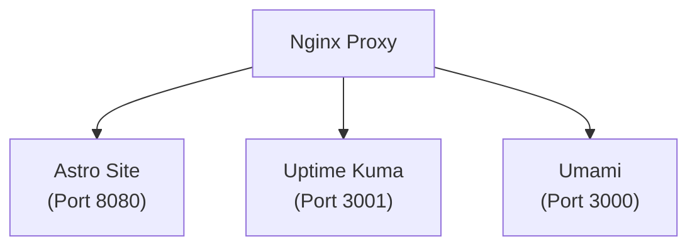

After setting up my personal VPS infrastructure on AWS, I wanted to dive deeper into Site Reliability Engineering (SRE) concepts. Since I was already paying for an EC2 instance (`smol-ivan`) to host my main Astro website, it made sense to utilize the remaining capacity to explore basic service monitoring and analytics.

I decided to self-host two lightweight tools:

- **Uptime Kuma:** For uptime monitoring and service health status pages.
- **Umami:** For privacy-friendly, simple web analytics without the footprint of traditional tracking platforms.

## 1. Keeping Environments Isolated

To keep operations clean, I separated the deployment lifecycle of these tools from my main website pipeline. My personal site goes through automated CI/CD runs via GitHub Actions whenever I push updates. Monitoring tools, on the other hand, follow a "deploy once and let run" pattern.

I placed Uptime Kuma and Umami in a dedicated `docker-compose.yml` stack on the VPS:

```yaml
# Infrastructure services stack (smol-ivan)

services:
    uptime-kuma:
        image: louislam/uptime-kuma:1
        container_name: uptime-kuma
        restart: always
        volumes:
            - kuma-data:/app/data

    umami:
        image: ghcr.io/umami-software/umami:postgresql-latest
        container_name: umami
        restart: always
        environment:
            DATABASE_URL: ${DATABASE_URL}
        ports:
            - "3000:3000"

volumes:
    kuma-data:
```

## 2. Nginx Reverse Proxy & TLS Extension

Since I already had Certbot configured for TLS certificate management on my domain, adding subdomains for Uptime Kuma and Umami was straightforward.



- Configured Nginx server blocks for each subdomain.

- Ran certbot --nginx to issue expanded certificates.

- Routed internal traffic directly to the Docker containers.

## 3. Takeaways

Given that my personal website doesn't get high volumes of traffic, adding these tools didn't drastically change day-to-day operations. However, taking monitoring and analytics out of the "black box" category and configuring them directly on my own server made the underlying infrastructure concepts much clearer.
