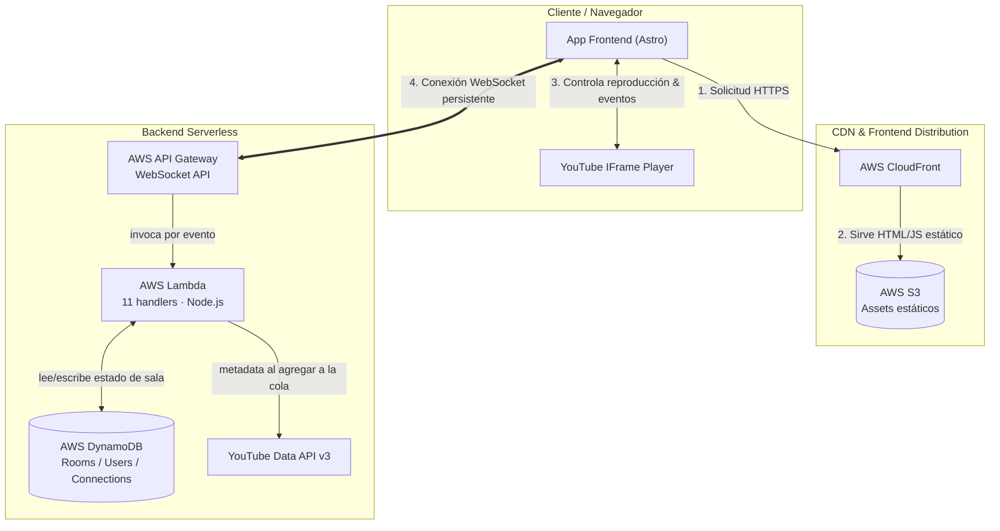

During the pandemic, I spent a lot of time following the VTuber community. Around the time of a major online concert, someone pinned a link in a Discord server to a custom watch room.

When I opened it, over 200 people were connected simultaneously—watching the stream in perfect sync, sending GIFs, and chatting together. Back then, I knew practically nothing about web development; I didn't even know what a variable was. I remember looking at the CyTube repository behind the site, feeling completely lost, and setting the idea aside.

Five or six years later, nearing the end of my Computer Engineering degree and focusing heavily on DevOps and cloud infrastructure, I found myself looking for a practical project to learn about AWS Lambda, serverless patterns, and real-time state management. I casually checked that old Discord server again, saw the original site still running, and decided it was time to build my own version: **smol-tube**.

## 1. System Overview

I don't like building projects without a clear personal use case. For `smol-tube`, the core requirement was simple: a lightweight room where a group of people could watch synchronized video streams and chat in real time.

## 2. Serverless Tech Stack & Infrastructure

- **Frontend & Distribution (S3 + CloudFront)**: The client is built with Astro for a fast, minimal footprint. Static build assets are stored in an Amazon S3 bucket and cached globally via Amazon CloudFront.

- **WebSocket Gateway (API Gateway)**: Manages long-lived client connections statefully. API Gateway handles the connection lifecycle ($connect, $disconnect, $default) and routes incoming messages to specific Lambda targets without requiring a constantly running server.

- **Compute Layer (AWS Lambda Handlers)**: Built with Node.js and TypeScript. Business logic is split into 11 granular, single-purpose handlers—ranging from room creation, playlist queue management, and video state synchronization to chat message broadcasting.

- **State & Storage (Amazon DynamoDB)**: Provides single-digit millisecond latency to persist active WebSocket connection IDs, room states, playback timestamps, and user sessions.

- **External Integration (YouTube Data API v3)**: Fetches video metadata and validates durations whenever a user appends a new link to the playlist queue.

## 3. What I Took Away

Having recently finished a demanding course on concurrency, writing the WebSocket sync logic wasn't as intimidating as I initially feared. The real hurdle was simply getting over the lack of practical experience with real-time architectures.

Building `smol-tube` shifted how I think about system design:

1. **Decoupling Business Logic Early:** Separating room state management from transport protocols saved a lot of refactoring time when testing backend setups.
2. **Abstract Problem Solving:** Breaking down real-time sync into simple event sequences makes complex state drift problems manageable.

It was satisfying to close a loop that started years ago when code looked like gibberish to me.
